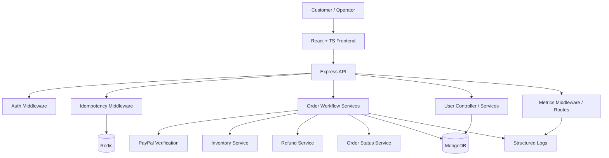
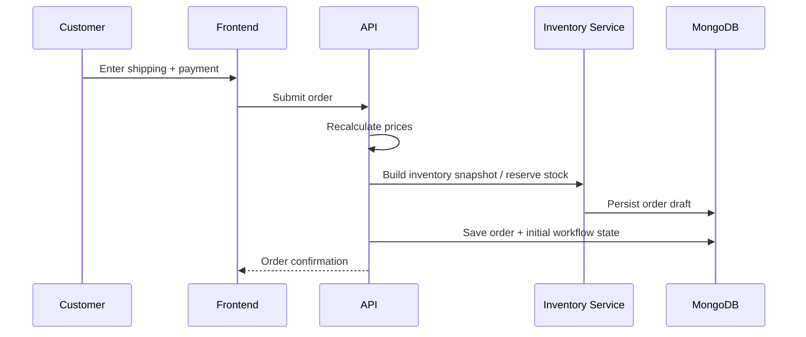
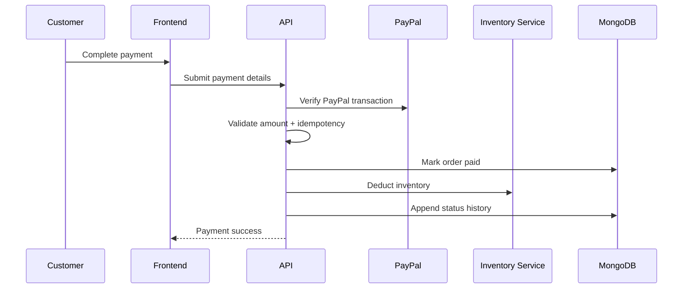
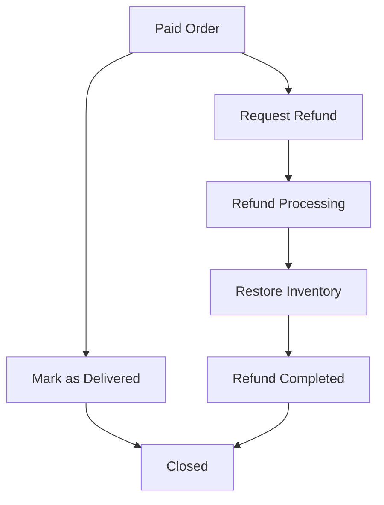
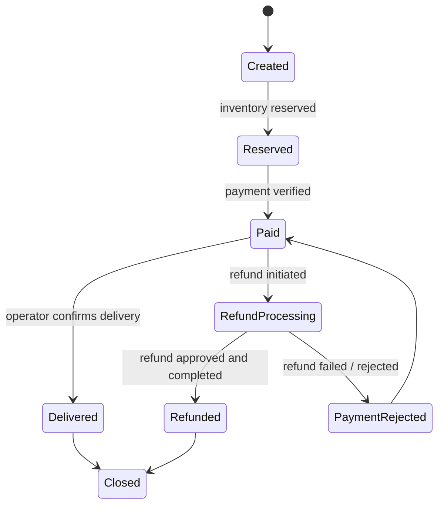

# vipshop-ecommerce Architecture

This document explains the structure of the VIPshop e-commerce transaction platform and how the major frontend and backend pieces fit together.

## 1. System overview

vipshop-ecommerce is organized around a transaction-first architecture. Rather than emphasizing catalog browsing, the system focuses on the operational core of commerce:

- cart and checkout
- order creation
- payment verification
- inventory reservation and deduction
- delivery confirmation
- refund reversal
- auditability and observability

The application is split into two major parts:

- **Frontend**: React + TypeScript user experience for checkout and order management
- **Backend**: Express + MongoDB workflow engine for transaction state transitions

## 2. High-level architecture

## 3. Frontend structure

The frontend is responsible for collecting user input and presenting transaction state clearly.

### Main screens
- `LoginScreen`
- `RegisterScreen`
- `CartScreen`
- `ShippingScreen`
- `PaymentScreen`
- `PlaceOrderScreen`
- `OrderScreen`
- `ProfileScreen`

### Shared components
- `Header`
- `Footer`
- `Loader`
- `Message`
- `FormContainer`
- `CheckoutSteps`
- `Meta`
- `PrivateRoute`

### State and API layer
- `authSlice`
- `cartSlice`
- `apiSlice`
- `usersApiSlice`
- `ordersApiSlice`

The frontend is deliberately thin: it collects intent, renders transaction state, and delegates all trusted business logic to the backend.

## 4. Backend structure

The backend is where the business rules live.

### Controllers
- `userController.js`
- `orderController.js`

### Services
- `orderFactoryService.js`
- `orderPricingService.js`
- `orderWorkflowService.js`
- `orderStatusService.js`
- `orderStateGuardService.js`
- `paymentService.js`
- `inventoryService.js`
- `refundService.js`

### Middleware
- `authMiddleware.js`
- `roleMiddleware.js`
- `idempotencyMiddleware.js`
- `metricsMiddleware.js`
- `requestLogger.js`
- `errorMiddleware.js`

### Utilities
- `logger.js`
- `metrics.js`
- `idempotencyStore.js`
- `errorCodes.js`
- `appError.js`

## 5. Data model

The order model is designed for traceability rather than just storage.

### Important workflow fields
- `fulfillmentStatus`
- `inventoryStatus`
- `refundStatus`
- `statusHistory`

These fields support operational review and give the UI enough information to show a clear timeline of the transaction.

### Why this matters
A production transaction system often needs to answer questions like:
- Was inventory reserved before payment completed?
- Was a refund requested, processed, or rejected?
- Who changed the order state and when?
- Did delivery happen after payment verification?

The status fields and history records are the answer to those questions.

## 6. Request flow

### Order creation flow

### Payment flow

### Delivery and refund flow

## 7. State machine

### State transition principles
- Each transition should be explicit and recorded
- Critical transitions should be protected by idempotency checks
- Invalid transitions should fail fast
- Auditing should be possible from the order record alone

## 8. Role model

### Customer
- registers and signs in
- creates a cart and checkout request
- places orders
- views order progress and status history

### Operator / Admin
- marks orders as delivered
- initiates or approves refund handling
- reviews order status and workflow state

### System services
- enforce payment and inventory correctness
- guard against duplicate requests
- record metrics and logs
- maintain transaction auditability

## 9. Observability

VIPshop includes operational visibility because transaction systems need more than just success/failure responses.

### What is tracked
- request duration
- order creation outcomes
- payment success and failure
- refund success and failure
- structured error logs
- system-level errors

### Why it matters
If a payment fails, the system needs to know whether the failure came from:
- invalid input
- PayPal verification
- inventory mismatch
- duplicate submission
- internal workflow issues

Metrics and logging make that visible.

## 10. Design goals

The architecture is optimized for:
- correctness over cosmetic complexity
- explicit workflow transitions
- traceable transaction history
- safe retries and duplicate protection
- a UI that exposes business state clearly

## 11. Summary

`vipshop-ecommerce` is built as a transaction platform rather than a simple storefront. Its architecture is designed to keep order logic trustworthy, payment handling auditable, inventory updates consistent, and operational state easy to inspect.
