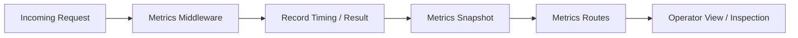

# vipshop-ecommerce Observability

This document explains how the platform surfaces operational behavior through logs, metrics, and status history.

## 1. Observability goals

`vipshop-ecommerce` is a transaction platform, so observability is part of the product rather than an afterthought.

The main goals are to understand:
- what happened
- when it happened
- which request caused it
- whether it succeeded or failed
- whether the failure was recoverable
- whether the system state remained consistent

## 2. What the platform tracks

### Request-level signals
- request duration
- route and method
- response status
- high-severity failures
- authentication failures
- authorization failures

### Transaction-level signals
- order creation outcomes
- payment verification outcomes
- refund outcomes
- delivery updates
- inventory changes
- duplicate request attempts

### State-level signals
- workflow state transitions
- status history records
- payment status changes
- inventory status changes
- refund status changes

## 3. Logging model

The backend uses structured logging so transaction behavior can be inspected without searching through unstructured console output.

### Log categories
- request logs
- state audit logs
- payment failure logs
- refund failure logs
- inventory failure logs
- system error logs
- unhandled exception logs

### Why structured logs matter
If a payment or refund problem occurs, operators need to know:
- which order was affected
- which endpoint triggered the issue
- which state transition failed
- whether the failure was caused by user input or system behavior

## 4. Metrics model

The platform records metrics to show whether the transaction system is healthy.

### Example metrics
- request latency
- order creation success and failure counts
- payment success and failure counts
- refund success and failure counts
- internal error counts

### Metrics flow

## 5. Metrics routes

The backend exposes dedicated endpoints for operational inspection.

### Typical use cases
- verify whether the API is experiencing errors
- inspect latency trends
- confirm whether order/payment/refund flows are succeeding
- reset counters during local development or test runs

## 6. Idempotency as observability support

Idempotency is not only a correctness feature. It also improves observability by making repeated critical requests visible and safe.

### Benefits
- duplicate payment callbacks become visible and harmless
- repeated order submissions do not create inconsistent state
- retry behavior can be measured rather than feared

## 7. Order status history

The `statusHistory` field on the order record acts as a built-in audit trail.

### Examples of recorded events
- order created
- inventory reserved
- payment verified
- delivered
- refund initiated
- refund completed

### Why it is important
This lets support staff, operators, and developers reconstruct the lifecycle of the order even if logs have rotated.

## 8. Error normalization

Errors are normalized into consistent response shapes so the UI and logs can rely on predictable behavior.

### Common categories
- validation
- unauthorized
- forbidden
- not found
- conflict
- payment failure
- inventory failure
- internal error

### Outcome
The frontend can display a friendly message, while the backend still keeps the detailed technical context.

## 9. Observability summary

`vipshop-ecommerce` treats observability as part of the transaction workflow:
- logs explain what happened
- metrics show how often it happens
- status history shows the business state over time
- idempotency prevents duplicate writes from becoming operational incidents
