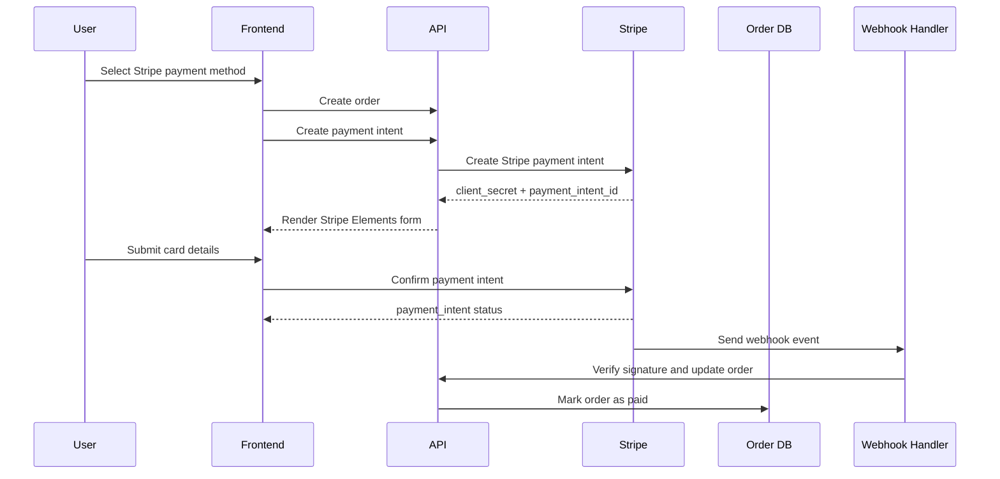

# Stripe Integration Design

This document explains how Stripe is integrated into `vipshop-ecommerce` and how the payment and webhook flow works.

The goal is to support Stripe as a first-class payment provider alongside PayPal while keeping the payment layer clean, auditable, and safe against duplicate processing.

---

## 1. Design goals

Stripe was added to solve three product and engineering goals:

- provide a second payment provider for the checkout flow
- support real card payments through Stripe Elements
- keep payment verification and order state changes idempotent

The integration is designed so that Stripe-specific logic stays isolated in dedicated controllers and services rather than being scattered across the checkout UI or order workflow.

---

## 2. High-level Stripe flow

---

## 3. Frontend design

### Payment method selection
The payment screen supports multiple providers. When the customer chooses Stripe:

- the payment method is stored in cart state
- the checkout page creates a Stripe payment intent after the order is created
- Stripe Elements is mounted with the returned `client_secret`

### Checkout UI behavior
The `PlaceOrderScreen` handles two different paths:

#### PayPal path
- create the order
- redirect to the PayPal flow
- let PayPal confirm payment

#### Stripe path
- create the order
- request a Stripe payment intent
- render a real `PaymentElement`
- confirm the payment on the client
- finalize payment state on the backend

### Why Elements is used
Stripe Elements is the correct choice because it:

- keeps card data inside Stripe-managed UI
- reduces PCI burden
- gives a real production-style card payment experience
- works well with payment intents and webhooks

---

## 4. Frontend data flow

### Relevant screens
- `PaymentScreen` selects the provider
- `PlaceOrderScreen` creates the order and renders payment UI
- `OrderScreen` shows the final transaction state

### Stripe-related client flow
1. User selects Stripe as the payment method.
2. User submits the order.
3. The backend creates an order record.
4. The frontend requests a Stripe payment intent for that order.
5. The frontend mounts `Elements` using the returned `client_secret`.
6. The customer enters card details in `PaymentElement`.
7. Stripe confirms the payment.
8. The frontend notifies the backend of the payment result.
9. The webhook handler later acts as the final source of truth.

---

## 5. Backend API design

### Routes
Stripe is exposed through dedicated routes:

- `GET /api/stripe/config`
- `POST /api/stripe/create-payment-intent`
- `POST /api/stripe/confirm-payment`
- `POST /api/stripe/webhook`

### Route responsibilities

#### `GET /api/stripe/config`
Returns the public Stripe configuration needed by the frontend, such as the publishable key.

#### `POST /api/stripe/create-payment-intent`
Creates a Stripe payment intent for an existing order.

#### `POST /api/stripe/confirm-payment`
Stores the client-visible payment result after Stripe confirmation.

#### `POST /api/stripe/webhook`
Handles async payment events from Stripe and reconciles them with order state.

---

## 6. Backend responsibilities

### `stripeController`
The controller owns the request lifecycle:

- validating the order exists
- ensuring the order is not already paid
- creating the payment intent
- recording payment intent metadata on the order
- handling webhook events
- applying idempotent updates to the order record

### `stripeService`
The service owns Stripe SDK interaction:

- creating payment intents
- verifying webhook signatures
- isolating Stripe SDK configuration from request logic

### `orderModel`
The order schema stores Stripe-specific state so the payment lifecycle can be audited later.

---

## 7. Database fields

The order model includes the following Stripe-aware fields:

- `paymentProvider`
- `paymentIntentId`
- `paymentStatus`
- `paymentResult`
- `stripeEventIds`

### Field purpose

#### `paymentProvider`
Identifies which gateway completed the payment, such as `paypal` or `stripe`.

#### `paymentIntentId`
Stores the Stripe payment intent identifier for reconciliation and webhook lookup.

#### `paymentStatus`
Tracks the gateway-level state of the payment.

#### `paymentResult`
Stores provider response metadata such as intent id, status, timestamp, and receipt email.

#### `stripeEventIds`
Stores processed webhook event ids so repeated webhook delivery does not trigger duplicate updates.

---

## 8. Webhook design

Stripe webhooks are treated as the authoritative payment confirmation mechanism.

### Why webhooks matter
Client-side confirmation is useful for user feedback, but webhook delivery is the source of truth for asynchronous payment state. This is important because:

- network failures can interrupt the client flow
- the browser can close before the payment result is fully persisted
- Stripe may retry webhook delivery
- order state must remain correct even if the browser session disappears

### Webhook flow
1. Stripe sends a webhook event.
2. The backend verifies the Stripe signature.
3. The backend checks the event type.
4. The backend finds the matching order using metadata or payment intent id.
5. The backend checks whether the event was already processed.
6. The backend updates the order state.
7. The backend records the event id for idempotency.
8. The backend logs the state change.

---

## 9. Webhook event handling

### `payment_intent.succeeded`
This event marks the order as paid.

Processing steps:
- verify event signature
- locate the order
- skip processing if the event id was already seen
- set `isPaid = true`
- set `paidAt`
- set `paymentStatus = completed`
- persist provider metadata
- write a state-change log

### `payment_intent.payment_failed`
This event marks the intent as failed without marking the order as paid.

Processing steps:
- verify event signature
- locate the order
- record failure status
- store the latest Stripe metadata
- keep the order unpaid

### Why this split matters
It allows the system to distinguish between:
- a successful payment that should advance the workflow
- a failed payment that should preserve the order for later retry or support review

---

## 10. Idempotency strategy

Stripe can retry webhooks, and users can retry client actions. The integration avoids duplicate side effects using several checks:

- payment intent ids are stored on the order
- webhook event ids are stored in `stripeEventIds`
- already-paid orders are short-circuited
- mismatched payment intent ids are rejected
- provider mismatches are rejected

This prevents:
- duplicate settlement
- double inventory deduction
- repeated status history entries
- accidental race conditions during retries

---

## 11. Security considerations

### Webhook signature verification
The webhook endpoint uses Stripe signature verification before trusting the payload.

### Secret isolation
- `STRIPE_SECRET_KEY` stays on the backend only
- `STRIPE_WEBHOOK_SECRET` stays on the backend only
- the frontend only receives the publishable key

### Order ownership
Payment intent creation is tied to an existing order so that the payment request always maps back to a trusted order record.

---

## 12. Failure handling

### Common failure cases
- order not found
- order already paid
- Stripe config missing
- webhook signature missing or invalid
- payment intent mismatch
- unsupported payment provider

### Expected behavior
- return a clear error to the client when the issue is user-facing
- preserve a stable order record for support review
- do not mark the order as paid unless Stripe confirms success

---

## 13. Interview-ready explanation

If asked to explain the Stripe design in an interview, the simplest strong answer is:

> Stripe was integrated as a second payment provider using a provider-aware order model, a dedicated payment intent endpoint, Stripe Elements for card entry, and webhook-based confirmation for final payment state. The design keeps card data inside Stripe-managed UI, stores payment metadata on the order for auditing, and uses webhook event ids plus payment intent ids to prevent duplicate processing.

That answer shows you understand both the UI and backend sides of payment systems.

---

## 14. Summary

The Stripe integration in `vipshop-ecommerce` is designed to be production-friendly:

- real card UI through Stripe Elements
- clear separation of frontend and backend responsibilities
- webhook-driven confirmation
- idempotent order updates
- durable payment metadata for support and auditing

This makes Stripe a first-class provider rather than a one-off integration.
