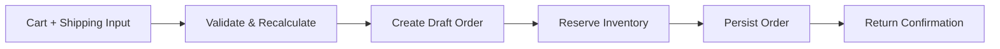
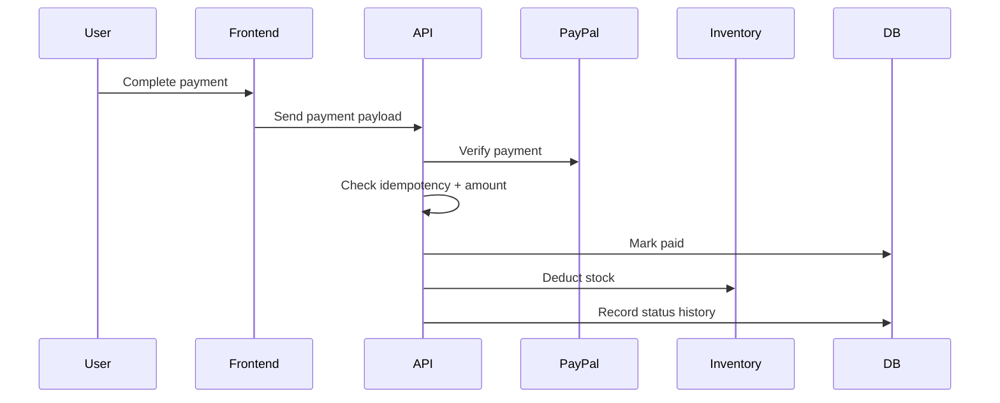
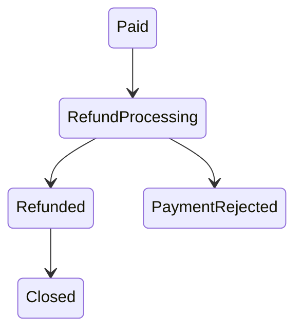

# vipshop-ecommerce Transaction Workflow

This document describes the end-to-end business flow of the VIPshop platform.

## 1. Workflow philosophy

`vipshop-ecommerce` is centered on the idea that an order is not just a database record. It is a managed business process.

That process moves through several important stages:

- cart assembly
- shipping collection
- payment method selection
- order creation
- payment verification
- inventory deduction
- delivery confirmation
- refund handling
- audit trail recording

The workflow is designed to be deterministic, observable, and safe against duplicate writes.

## 2. Order creation

### Steps
1. User submits cart and shipping information.
2. The backend rebuilds the order from trusted inventory snapshot data.
3. Prices are recalculated server-side.
4. A draft order is created.
5. Initial workflow status is recorded.
6. Inventory is reserved.
7. The finalized order is saved.

### Flow

## 3. Payment verification

### Steps
1. User completes payment in the frontend.
2. Payment details are sent to the backend.
3. PayPal transaction is verified.
4. The payment amount is checked against the order total.
5. Idempotency checks prevent duplicate capture.
6. The order is marked as paid.
7. Inventory is deducted.
8. Workflow state is advanced.

### Important safeguards
- reject already-used payment transactions
- reject mismatched payment amounts
- reject duplicate callback submissions
- record the outcome for later review

### Flow

## 4. Delivery handling

### Steps
1. Admin reviews the paid order.
2. Admin marks it as delivered.
3. Delivery timestamp is recorded.
4. Order status history is updated.

### Notes
Delivery should only occur after successful payment. The workflow uses explicit status checks to prevent invalid transitions.

## 5. Refund handling

### Steps
1. Admin or operator initiates refund.
2. Refund enters processing state.
3. Inventory is restored.
4. Refund is completed or rejected.
5. Payment metadata is cleared if necessary.
6. Workflow history is appended.

### Flow

## 6. Status history

The order record stores a timeline of meaningful events.

### Example events
- order created
- inventory reserved
- payment verified
- delivered
- refund requested
- refund completed

### Why it matters
A timeline gives both customers and operators a clear view of where the order is in the lifecycle.

## 7. Idempotency behavior

Critical workflow actions use idempotency protection.

### Protected operations
- order creation
- payment handling
- refund handling
- other state-changing endpoints as required

### Purpose
Idempotency ensures that retries, accidental double-clicks, or repeated callbacks do not corrupt the transaction state.

## 8. Error handling

Workflow errors are normalized so they can be displayed and logged consistently.

### Common failure categories
- validation errors
- unauthorized access
- forbidden actions
- order conflicts
- inventory problems
- payment verification failures
- duplicate transaction attempts
- internal errors

### Outcome
Users get a meaningful message, while the backend keeps structured logs for diagnosis.

## 9. Frontend presentation of workflow

The frontend makes the workflow visible through:
- `CheckoutSteps`
- order detail cards
- payment/delivery/refund indicators
- status timeline
- loader states during async operations

This keeps the UI aligned with the actual transaction state rather than showing static success pages.

## 10. Workflow summary

`vipshop-ecommerce`’s workflow is designed to be:
- explicit
- auditable
- retry-safe
- operationally visible
- resistant to duplicate writes

That makes it a good representation of how real production commerce systems manage transaction state.
