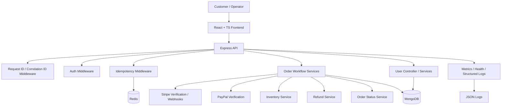

# E-commerce Transaction Platform

Production-style e-commerce transaction platform covering orders, payments, refunds, webhook idempotency, observability, testing, and Docker.

This project is intentionally scoped to the parts that matter most in real systems:

- order consistency
- payment verification
- inventory coordination
- refund rollback
- webhook idempotency protection
- auditable status transitions
- structured logging and health checks
- testability and type safety

The result is a system that looks and behaves more like a real production service than a simple storefront demo.

---

## What this project demonstrates

- End-to-end e-commerce transaction workflows
- Stripe and PayPal payment integration
- Webhook idempotency and payment reconciliation
- Refund handling and auditable order state transitions
- Structured logging, request tracing, health checks, and metrics
- Frontend-to-backend integration with React, TypeScript, and RTK Query
- Automated tests for payment and order workflows

## Why this project exists

Most e-commerce demos spend their time on product browsing and visual catalog features. This e-commerce transaction platform focuses instead on the transactional core:

- Can an order be created safely?
- Can payment be verified reliably?
- Can duplicate payment callbacks be ignored?
- Can inventory be reserved and restored correctly?
- Can operators see what happened to an order at each stage?
- Can the system be monitored and debugged like a real service?

That is the part employers care about when they ask about system design, backend reliability, and production readiness.

---

## Core capabilities

### Customer-facing workflow

- Registration and login
- Cart management
- Shipping address collection
- Payment method selection
- Stripe card payment through `Elements` / `PaymentElement`
- PayPal checkout support
- Order placement
- Order detail tracking
- Transaction status timeline

### Operational workflow

- Order delivery confirmation
- Refund handling
- Payment verification
- Inventory deduction and restoration
- Status history auditing
- Metrics and request observability
- Structured logs with request / correlation ids
- Health checks
- Redis-backed idempotency protection for critical endpoints

---

## Technology stack

### Frontend

- React
- TypeScript
- Redux Toolkit
- RTK Query
- React Router
- React Bootstrap
- Stripe React SDK
- PayPal React SDK

### Backend

- Node.js
- Express
- MongoDB
- Mongoose
- JWT authentication
- Stripe API
- PayPal REST API
- Redis for idempotency and runtime coordination

### Testing and quality

- Vitest
- React Testing Library
- Node-based API tests
- Stripe webhook tests
- Order state machine tests
- TypeScript type checking

### Observability

- Request logging
- Structured event logs
- Payment failure logs
- Stripe webhook failure logs
- Metrics endpoint
- Health endpoint

---

## System architecture



---

## Frontend Architecture & Structure

The frontend is intentionally thin and transaction-focused. It collects user intent, manages checkout state, renders payment and order status, and delegates trusted business logic to backend services.

### Key frontend responsibilities include:

- Authentication and protected routes
- Cart and checkout state management
- Stripe and PayPal payment UI integration
- Order status rendering
- Loading, error, and empty states
- API communication through RTK Query
- Shared TypeScript types for frontend-backend contracts

This design keeps the frontend focused on user interaction and transaction visibility, while backend services handle trusted business rules such as payment verification, refund handling, inventory coordination, and order state transitions.

Frontend technologies used in this project include React, TypeScript, Redux Toolkit, RTK Query, React Router, React Bootstrap, Stripe React SDK, and PayPal React SDK.

### Screens

- `LoginScreen`
- `RegisterScreen`
- `CartScreen`
- `ShippingScreen`
- `PaymentScreen`
- `PlaceOrderScreen`
- `OrderScreen`
- `ProfileScreen`

### Shared components

- `Header`
- `Footer`
- `Loader`
- `Message`
- `FormContainer`
- `CheckoutSteps`
- `Meta`
- `PrivateRoute`

### State and API layer

- `authSlice`
- `cartSlice`
- `apiSlice`
- `usersApiSlice`
- `ordersApiSlice`

### Shared type structure

Frontend types are organized by domain:

- `frontend/src/types/order/`
- `frontend/src/types/payment/`
- `frontend/src/types/user/`
- `frontend/src/types/shared/`
- `frontend/src/types/index.ts`

The frontend is deliberately thin: it collects intent, renders transaction state, and delegates all trusted business logic to the backend.

---

## Backend structure

### Controllers

- `userController.ts`
- `orderController.ts`
- `stripeController.ts`

### Services

- `orderFactoryService.ts`
- `orderPricingService.ts`
- `orderWorkflowService.ts`
- `orderStatusService.ts`
- `orderStateGuardService.ts`
- `paymentService.ts`
- `inventoryService.ts`
- `refundService.ts`
- `stripeService.ts`

### Middleware

- `authMiddleware.ts`
- `roleMiddleware.ts`
- `idempotencyMiddleware.ts`
- `metricsMiddleware.ts`
- `requestLogger.ts`
- `healthMiddleware.ts`
- `errorMiddleware.ts`

### Utilities

- `logger.ts`
- `metrics.ts`
- `idempotencyStore.ts`
- `errorCodes.ts`
- `appError.ts`
- `requestContext.ts`

### Backend DTO / type structure

Backend types are organized by domain:

- `backend/types/order/`
- `backend/types/payment/`
- `backend/types/user/`
- `backend/types/shared/`
- `backend/types/index.ts`

---

## Stripe integration

Stripe is implemented as a first-class payment provider rather than a quick demo callback.

### Flow overview

1. The user selects Stripe as the payment method.
2. The frontend creates the order.
3. The backend creates a Stripe payment intent for that order.
4. The frontend mounts Stripe `Elements` with the returned `clientSecret`.
5. The user enters card details in `PaymentElement`.
6. Stripe confirms payment.
7. The frontend posts the payment result back to the backend.
8. Stripe webhooks reconcile the final payment state.

### Why this design is production-friendly

- card data stays inside Stripe-managed UI
- the backend stores `paymentIntentId` and payment metadata on the order
- webhook events are idempotent
- duplicate delivery of webhook events does not double-process payment
- failures are logged with structured context

See `docs/stripe.md` for the full design write-up.

---

## Observability

The project now includes a small but realistic observability layer.

### Request tracing

Each request can carry:

- `x-request-id`
- `x-correlation-id`

These values are propagated into structured logs so a single business transaction can be followed across the stack.

### Structured logs

Logs are emitted as JSON entries with fields such as:

- timestamp
- level
- event
- requestId
- correlationId
- orderId
- paymentIntentId
- statusCode
- durationMs

### Health and metrics

- `GET /api/health`
- `GET /api/metrics`
- `POST /api/metrics/reset`

This gives the project a more production-like operations surface.

See `docs/observability.md` for more detail.

---

## Testing

The test strategy is centered on transactional correctness.

### Current coverage themes

- Stripe webhook success handling
- Stripe webhook duplicate-event handling
- Stripe webhook error handling
- order state machine guard rules
- payment method selection UI
- Stripe checkout form behavior
- localStorage-backed checkout state

### Why this matters

These are the paths most likely to cause production incidents if they regress:

- duplicate payment updates
- invalid order state transitions
- payment provider flow breakage
- checkout UI regressions

See `docs/tests.md` for the full testing strategy.

---

## Docker setup

The project can be started with Docker for a more production-like local environment.

### Services included

- `backend` on port `5000`
- `frontend` on port `3000`
- `mongo` on port `27017`
- `redis` on port `6379`

### Container communication

- The frontend is served by Nginx and talks to the backend through the API base URL configured in the app.
- The backend connects to MongoDB and Redis using the service names defined in `docker-compose.yml`.
- Inside Docker Compose, the backend should use the service hostnames `mongo` and `redis`, not `localhost`.

### Required environment variables

At minimum, the backend container needs the same values you would use locally, such as:

- `MONGO_URI`
- `JWT_SECRET`
- `PAYPAL_CLIENT_ID`
- `PAYPAL_APP_SECRET`
- `PAYPAL_API_URL`
- `REDIS_URL`
- `STRIPE_SECRET_KEY`
- `STRIPE_WEBHOOK_SECRET`
- `VITE_STRIPE_PUBLISHABLE_KEY`

### Docker Compose startup

From the repository root:

```bash
docker compose up --build
```

This will:

- build the backend image
- build the frontend image
- start MongoDB and Redis
- expose the app locally

### Access after startup

- Frontend: `http://localhost:3000`
- Backend API: `http://localhost:5000`
- MongoDB: `mongodb://localhost:27017`
- Redis: `redis://localhost:6379`

### Notes for local development

If you are not using Docker:

- start the backend and frontend separately with the package scripts
- use your local MongoDB and Redis instances
- keep the frontend proxy / API base URL aligned with your dev setup

---

## Getting started

### Install dependencies

```bash
npm install
npm install --prefix frontend
```

### Run locally

```bash
npm run dev
```

### Run tests

```bash
npm test
```

### Type check

```bash
npm run typecheck
```

---

## Documentation map

- `docs/architecture.md` — system architecture and component boundaries
- `docs/workflow.md` — business workflow and state transitions
- `docs/stripe.md` — Stripe payment and webhook design
- `docs/tests.md` — test strategy and coverage philosophy
- `docs/observability.md` — logs, metrics, and runtime visibility

---

## Summary

The E-commerce Transaction Platform is built as a transaction-focused system rather than a simple storefront.
